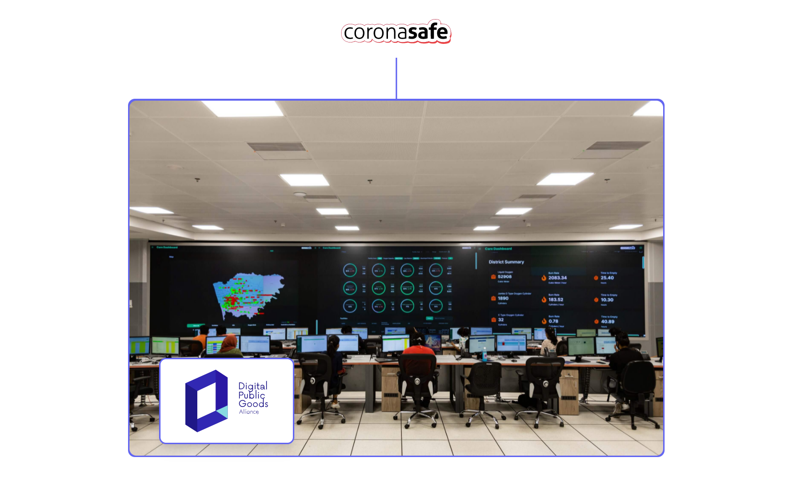

# Reimagining Pandemic Management

**CoronaSafe Network** is a free and open-source disaster management system that is used by National Health Mission, Government of India and various state governments for reimaging digital war rooms. The solution that students got an opportunity to intern with has supported 3.34*Lac patient management and 1.29* Lac ambulance shiftings and is approved by the United Nations as a [Digital Public Good.](https://digitalpublicgoods.net/)

> Stats as on 13th October 2021
